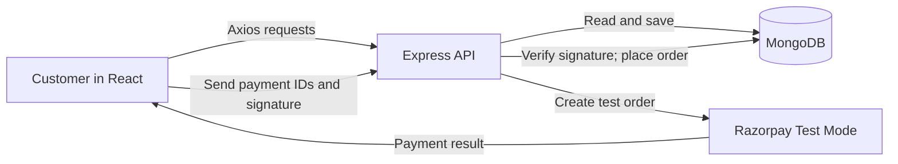

# ShopKart

ShopKart is a MERN shopping application. A customer can browse products, save items to a wishlist, manage a cart, pay through Razorpay **Test Mode**, and view their order history. The project brings together Lab 04 (wishlist), Lab 05 (cart), and Lab 06 (checkout and orders) in one frontend and backend.

## What we made

| Part | Customer-facing result | Main idea |
| --- | --- | --- |
| Accounts and catalog | Register, sign in, search products, and open product details | Each customer has their own data. |
| Wishlist | Save and remove products for later | Store product references on the customer and load current product details when displaying them. |
| Cart | Add products, change quantities, remove products, and see a subtotal | Persist product references and quantities; check stock on the server. |
| Checkout | Enter a shipping address and pay in Razorpay Test Mode | Recalculate the amount from the database and verify the payment signature before placing the order. |
| Orders | See order confirmation, history, and details | Save a snapshot of the products, prices, and address at purchase time. |

## How we built it

- **Frontend:** React and Vite render the pages. React Router handles navigation, Axios calls the API, and `CartContext` keeps the cart display in sync across pages.
- **Backend:** Express groups endpoints by customer, product, wishlist, cart, and order. Controllers validate requests and perform the work. JWT middleware identifies the signed-in customer before protected routes run.
- **Database:** MongoDB and Mongoose store customers, products, and orders. Customer records contain wishlist product IDs and cart entries (`product` ID plus `quantity`). Order records keep item and shipping snapshots.
- **Payments:** The backend creates Razorpay Test Mode orders. Razorpay opens in the frontend, but the secret key stays on the backend. The backend verifies the returned HMAC signature before marking an order paid.



### Customer workflow

1. **Sign in:** The backend hashes passwords with bcrypt. On login it issues a JWT in an HTTP-only cookie. Protected routes use that token to find the customer.
2. **Browse and save:** The frontend requests products from `/products`. A signed-in customer can add a product to `/wishlist`; the backend prevents duplicates.
3. **Build the cart:** Cart routes add products, update quantities, or remove them. The cart persists in MongoDB, so it is still there after a refresh or another login.
4. **Start checkout:** The customer enters their name, phone, and delivery address. The backend reads the cart and current products again, checks stock, and calculates the total itself. It saves a `PENDING_PAYMENT` order and creates a Razorpay order. Razorpay expects paise: ₹1,499 becomes `149900`.
5. **Verify payment:** Razorpay Checkout returns payment IDs and a signature. The frontend sends them to `/orders/verify-payment`. The backend matches the saved Razorpay order ID and checks the signature with the private secret. Only then does it mark the order `PAID` / `PLACED` and clear the cart. A failed or dismissed payment leaves the cart available.
6. **View orders:** `/orders` and `/orders/:id` return only the signed-in customer's records. Saved item names and prices remain as they were when the order was created, even if the catalog changes later.

## Where the important code lives

| Path | Responsibility |
| --- | --- |
| `frontend/src/pages/` | Catalog, account, wishlist, cart, checkout, and order pages |
| `frontend/src/context/CartContext.jsx` | Shared cart state and refresh/mutation functions |
| `frontend/src/services/api.js` | Axios client and backend URL |
| `backend/routes/` | API URLs and authentication requirements |
| `backend/controllers/` | Validation, cart and wishlist behavior, order creation, and payment verification |
| `backend/models/` | Customer, Product, and Order Mongoose schemas |
| `backend/middlewares/auth.middleware.js` | JWT checks and current customer ID |
| `backend/services/razorpay.service.js` | Razorpay Test Mode client; reads backend-only keys |
| `backend/tests/` and `postman/` | Automated integration tests and API collections |

## API overview

| Area | Routes |
| --- | --- |
| Customers | `/customers/register`, `/customers/login`, `/customers/me`, `/customers/logout` |
| Products | `/products`, `/products/:id` |
| Wishlist | `GET /wishlist`, `POST /wishlist/:productId`, `DELETE /wishlist/:productId` |
| Cart | `GET /cart`, `POST /cart/:productId`, `PATCH /cart/:productId`, `DELETE /cart/:productId` |
| Orders | `POST /orders/create-payment-order`, `POST /orders/verify-payment`, `GET /orders`, `GET /orders/:id` |

Wishlist, cart, and order routes require authentication. The browser sends the login cookie automatically; the API tests can use a bearer token.

## Run locally

You need Node.js, npm, a local MongoDB server or MongoDB Atlas database, and Razorpay **Test Mode** keys for checkout. There are separate npm packages in `backend/` and `frontend/`; there is no root `package.json`.

1. Copy `backend/.env.example` to `backend/.env` and fill in your own values:

   ```env
   MONGO_URI=mongodb://127.0.0.1:27017/shopkart
   PORT=3000
   JWT_SECRET=choose-a-long-random-value
   ADMIN_API_KEY=choose-a-different-long-random-value
   RAZORPAY_KEY_ID=rzp_test_your_key_id
   RAZORPAY_KEY_SECRET=your_test_secret
   ```

   Do not commit `backend/.env`. The `.gitignore` excludes `.env` files; only the placeholder `.env.example` is public.

2. Start the backend in one terminal:

   ```powershell
   cd backend
   npm install
   npm start
   ```

   Wait for `MongoDB connected` and `Server running on port 3000`.

3. Start the frontend in another terminal:

   ```powershell
   cd frontend
   npm install
   npm run dev
   ```

   Open the Vite URL, normally `http://localhost:5173`. The frontend calls `http://localhost:3000` by default. Set `VITE_API_URL` before starting Vite if the API is elsewhere. The backend allows the local Vite origin during development.

4. Register or sign in, add an in-stock product, then follow **Cart → Proceed to Checkout → Pay with Razorpay**. Use a Test Mode payment method; no real money is charged. After success, check the confirmation page, empty cart, and **My Orders**.

## Test the project

Run these commands from `backend/`:

```powershell
npm test
npm run test:lab4
npm run test:lab5
npm run test:lab6
npm run test:deployment
```

Run these commands from `frontend/`:

```powershell
npm run lint
npm run build
```

The integration tests use an isolated in-memory MongoDB. Lab 04 and Lab 05 also run their Postman collections with Newman. The Lab 06 integration test checks server-calculated totals, stock, ownership, valid and invalid signatures, cart clearing, and saved order snapshots. `test:deployment` builds the frontend and checks that the production server serves React pages and protects product creation. The Lab 06 Postman collection is in `postman/Lab-06-Checkout-Orders.postman_collection.json`; set its `email` and `password` variables to a disposable customer account. Complete one Test Mode payment in the browser to demonstrate the real Razorpay Checkout screen.

## Deploy on Render with MongoDB Atlas

The production server serves both the Express API and built React app from **one HTTPS domain**. This keeps the HTTP-only login cookie on the same site as the frontend. No Vercel project or cross-site cookie configuration is needed.

1. In [MongoDB Atlas](https://www.mongodb.com/atlas), create a cluster and a database user. Copy the driver connection string (including the database name) as `MONGO_URI`. Add your backend's outbound IPs to Atlas Network Access. If your Render plan does not provide stable outbound IPs, Atlas also offers `0.0.0.0/0` access for a demo; use a strong, unique database password and restrict access when a stable IP or private networking is available. A new Atlas database starts empty, so add products before demonstrating checkout.
2. In [Render](https://dashboard.render.com/), choose **New → Web Service**, connect `ekamjeet7025/shopkart`, and use branch `main`. Leave **Root Directory** blank because the build uses both folders. Choose Node, set **Build Command** to `npm ci --omit=dev --prefix backend && npm ci --include=dev --prefix frontend && npm run build --prefix frontend`, and **Start Command** to `npm start --prefix backend`. The frontend needs its development dependencies during the build; the backend does not need test packages at runtime.
3. Set these **environment variables in Render**, not in GitHub or the frontend:

   | Name | Value |
   | --- | --- |
   | `NODE_ENV` | `production` |
   | `MONGO_URI` | Your Atlas connection string |
   | `JWT_SECRET` | A new random string of at least 32 characters |
   | `ADMIN_API_KEY` | A different random string of at least 32 characters |
   | `RAZORPAY_KEY_ID` | Your Razorpay **Test Mode** key ID, beginning `rzp_test_` |
   | `RAZORPAY_KEY_SECRET` | The matching Razorpay Test Mode secret |

   Render provides `PORT`; do not set it yourself. Use a supported Node version for Vite 8 (Node 22.12+ or 20.19+). Set Render's health check path to `/health` if offered.
4. Deploy and open `https://<your-service>.onrender.com/health`; it should return `{"status":"ok"}`. The site itself is at the same domain. Wait for `MongoDB connected` in Render logs if the first deploy takes time.
5. If Atlas is new, add products through `POST https://<your-service>.onrender.com/products` from Postman with `Content-Type: application/json` and an `x-admin-key` header containing your `ADMIN_API_KEY`. The production endpoint refuses requests without that key. Never put the key into React code, `VITE_` variables, or a public Postman collection. You can also migrate your existing products to Atlas. Product images should use public HTTPS URLs or a path to a file in `frontend/public/`.

   ```json
   { "name": "Mechanical Keyboard", "description": "Compact keyboard", "price": 2999, "category": "Electronics", "image": "/product-placeholder.svg", "stock": 5 }
   ```

6. Test register/login, catalog, wishlist, cart, Razorpay Test Mode payment, order history, logout, and a direct refresh of `/checkout` or `/orders`. A successful login should set a `Secure`, `HttpOnly`, `SameSite=Lax` cookie. Keep the project in Test Mode; the backend rejects live Razorpay key IDs.

Production does not require `VITE_API_URL`: the frontend calls the API on the same Render domain. During local development it still calls `http://localhost:3000`. Do not publish MongoDB credentials, JWT secrets, Razorpay secrets, the admin key, or `.env` files.
